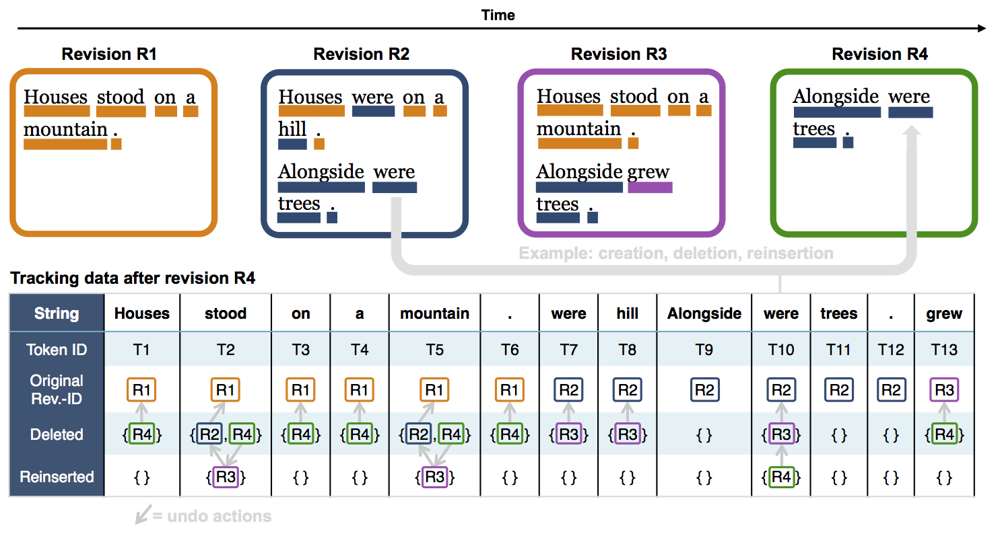
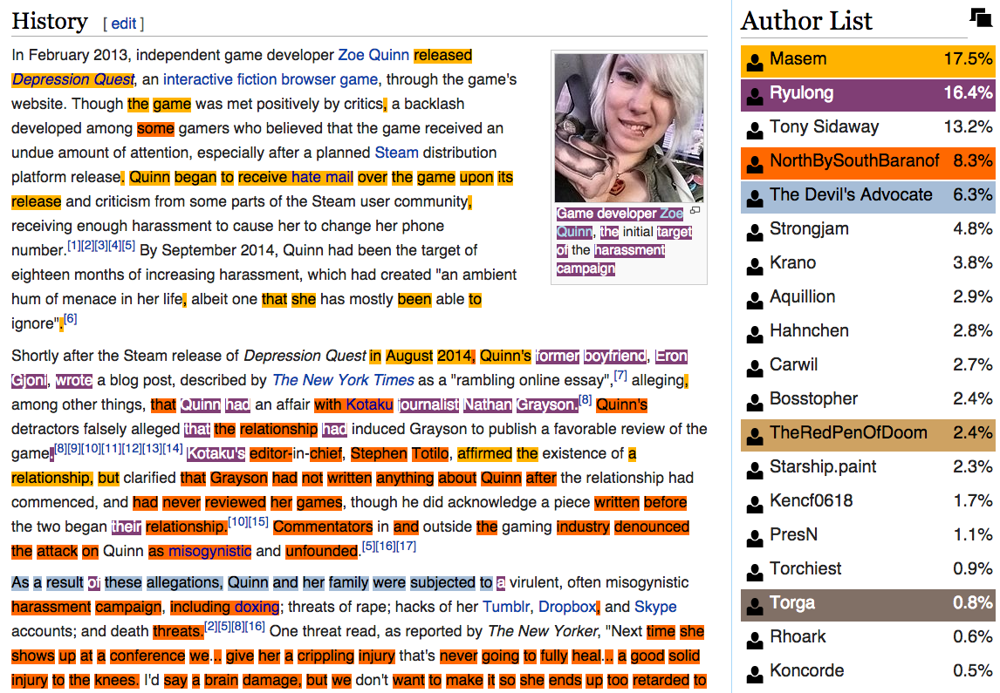
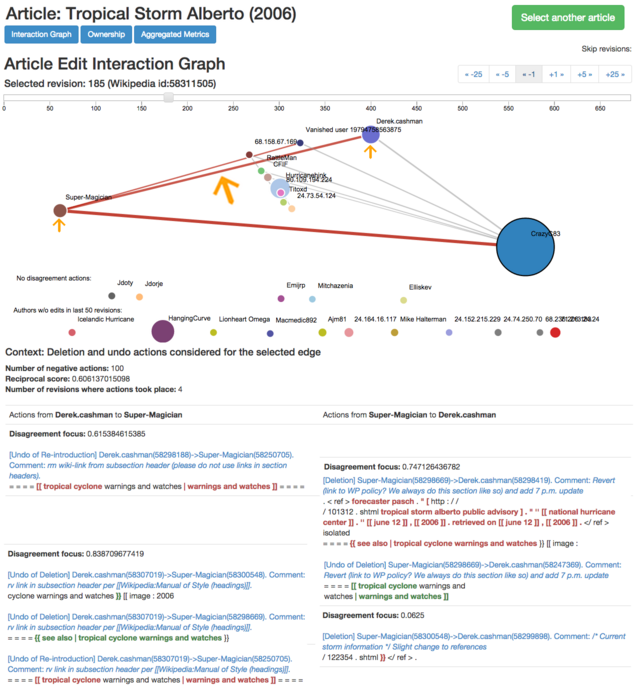

Future of WikiWho
==============

The WikiWho API is being transferred to [Wikimedia](https://wikimedia.org/), who will support the project in the future.

Introduction
==========

The WikiWho API gives access to the provenance/changes of words (tokens) in Wikipedia articles. It gives token-wise information from which revision what content originated (and thereby which editor originally authored the word) as well as all changes a token was ever subject to. This means that for every token (~word), its individual add/removal/reintroduction history becomes available. An additional set of APIs delivers special HTML markup for interface applications, e.g., the browser extension WhoColor.

WikiWho Algorithm
================

Given a revisioned text document, WikiWho parses the complete set of all historical revisions (versions) in order to find out who wrote and/or removed and/or reinserted which exact text at token level at what revision. This means that for every token (~word), its individual add/removal/reintroduction history becomes available.

The original algorithm working behind the scenes is described in a [WWW 2014 paper](https://dl.acm.org/doi/10.1145/2566486.2568026), along with an extensive evaluation resulting in 95% accuracy on fairly revision-rich articles. The current code version is available on [GitHub](https://github.com/wikiwho/WikiWho).

In a nutshell, the approach divides each revision into hierarchically nested paragraph, sentence and token elements and tracks their appearance through the complete content graph it builds in this way over all revisions. It is implemented currently for Wikitext, but can run on any kind of text in principle (although tokenization rules might have to be adapted).

Toy example for how the token metadata is generated:

In this way, it becomes possible to track – for each single token – all original additions, deletes, reinserts and redeletes and in which revision they took place. Which in turn allows to infer the editor, timestamp, etc. of those revisions. Also, individual tokens retain a unique ID, making it possible to distinguish two tokens with identical strings in different text positions.

Tools and further use cases
===========================

From the generated provenance and change data further new forms of data can be mined and novel tools can be built.

We already provide the **WhoColor userscript** for the Tamper-/Greasemonkey browser extensions (download [here](https://github.com/wikiwho/WhoColor/raw/master/userscript/whocolor.user.js), documentation [here](https://f-squared.org/whovisual/#color)), using live data from the [WhoColor API](https://api.wikiwho.net/#whocolor_api). Opening a Wikipedia article it creates a color-markup on the text, showing the original authors of the content, an author list ordered by percentages of the article written and additional provenance information. It also has the ability to show conflict regarding certain text parts and the adding/deleting history of a given word. The Wiki Edu Foundation currently uses the [WhoColor API for a similar display of authorship in its dashboard](https://dashboard.wikiedu.org/courses/RIT/American_Women's_and_Gender_History_(Fall_2016)/articles) for students learning to edit Wiki articles.

For WhoColor, we use an individual-token-level heuristic to compute conflict scores; yet, the sensible **identification of conflict** or disputes (as opposed to collaboration or non-interaction) related to a specific part of a changing document over time still poses several open research questions -- answers to which the WikiWho data can offer.

Another, related use case is the **extraction of relations between editors** in an article based on the minute interactions on each other's content. We provided a first, relatively simple implementation of this in an extension of WikiWho, using "(re)delete" and "reintroduce" actions between editors to encode antagonistic and supporting actions. [See the code on GitHub](https://github.com/maribelacosta/wikiwho). We have also developed an interactive Web visualization ("WhoVIS") that takes the antagonistic edit actions extracted in this manner (and weighted by speed, number of tokens changed, etc.) to draw an interaction network between editors in an article over time. In this manner, the relations between editors can be intuitively explored. [A usable Web demo](http://km.aifb.kit.edu/sites/whovis/index.html) and [a publication describing the approach are available](https://f-squared.org/whovisual/demo32.pdf).

Yet, the WikiWho data can be leveraged for much more intricate modeling of interactions, taking for instance into account the semantic content of changes, prior interactions of editors, etc.

We are also working on providing insights about editors of Wikipedia, based on WikiWho data: What they are working on, how successful they are in adding, deleting and replacing content, etc. A pilot project in this vein is a set of interactive, "clickable" Jupyter Notebooks called IWAAN that allow interactive analysis of article dynamics and editor behavior and that can be [launched directly in the cloud here](https://notebooks.gesis.org/binder/v2/gh/gesiscss/IWAAN/master?filepath=1_General_Metadata.ipynb). (Source code available [on GitHub](https://github.com/gesiscss/IWAAN))

Contributors
===========

WikiWho was first conceived as a dissertation project at [Karlsruhe Institute of Technology](https://www.kit.edu/english/) by (Fabian Flöck)[https://f-squared.org/] and collaborators and was then hosted, maintained and further developed at the [GESIS – Leibniz Institute for the Social Sciences, CSS Department](https://www.gesis.org/institut/abteilungen/computational-social-science).

The WikiWho API is being transferred to [Wikimedia](https://wikimedia.org/), who will support the project in the future.
